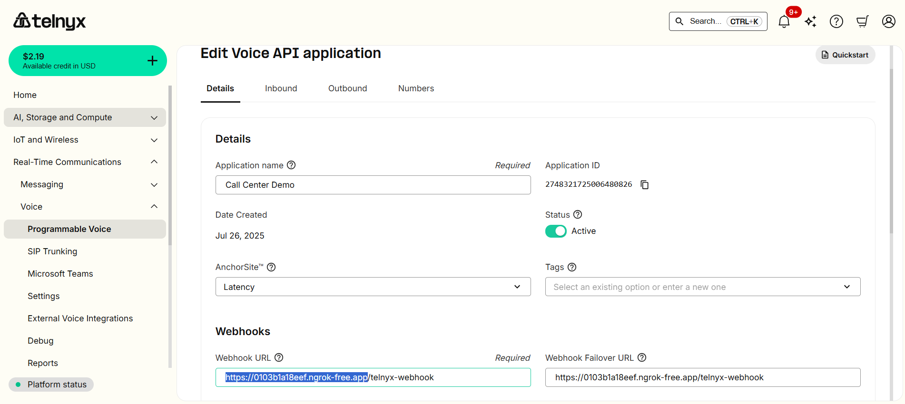

# Integración Telnyx + OpenAI Realtime API

Este proyecto permite recibir y realizar llamadas telefónicas con **Telnyx**, transmitiendo audio en tiempo real a la **OpenAI Realtime API** para generar respuestas automáticas por voz.

## 📋 Requisitos previos

1. **Python 3.9+**

2. Instalar dependencias:

   ```bash
   pip install -r requirements.txt
   ```

   *(Incluye `fastapi`, `uvicorn`, `pydub`, `requests`, `websockets`, `numpy`, `scipy`, `python-dotenv`)*
   Además, tener **ffmpeg** instalado en tu sistema para `pydub`.

3. Variables de entorno (`.env`):

   ```
   TELNYX_API_KEY=tu_api_key_telnyx
   TELNYX_CONNECTION_ID=tu_connection_id
   TELNYX_FROM_NUMBER=+1234567890
   BASE_URL=http://<ngrok-url>   # Se configurará más abajo
   OPENAI_API_KEY=tu_api_key_openai
   ```

## 🚀 Pasos para ejecutar

### 1. Levantar túnel con ngrok

En una terminal:

```bash
ngrok http 5000
```

Copia el **link http** que genere (ejemplo: `http://abcd1234.ngrok.io`).

### 2. Configurar BASE\_URL

En el archivo `.env`, coloca el link HTTP de ngrok:

```
BASE_URL=http://abcd1234.ngrok.io
```

### 3. Configurar Webhook en Telnyx

En la **Consola de Telnyx**, en la sección de tu **Realtime Comunication** luego a **Voice** y despues a **Programmable Voice**, agrega el webhook como se muestra en la imgaen:

```



```


### 4. Ejecutar el servidor

En otra terminal:

```bash
python app.py
```

El servidor escuchará en `http://0.0.0.0:5000`.

---

## 📞 Uso de la API

### Realizar llamada saliente

```bash
curl -Method POST http://localhost:5000/make_outbound_call `
      -Headers @{ "Content-Type" = "application/json" } `
      -Body '{"to": "+569xxxxx"}'
```


### Recibir llamada entrante

1. Llama al número asociado a tu **Telnyx Connection**.
2. El bot responderá automáticamente y transmitirá el audio a OpenAI en tiempo real.

---

## 💾 Grabaciones

Todas las llamadas se guardan en la carpeta `llamadas_guardadas/`:

* Audio entrante (`inbound_call_...wav` o `outbound_call_...wav`)
* Audio de respuesta del bot (`output_audio_...wav`)

---

## 🛠 Notas

* El sistema está configurado para usar codecs **PCMA** o **PCMU**.
* Para usar OPUS o G722, sería necesario implementar decodificación adicional.
* Asegúrate de que tu cuenta de Telnyx tenga habilitado **Media Streaming**.
